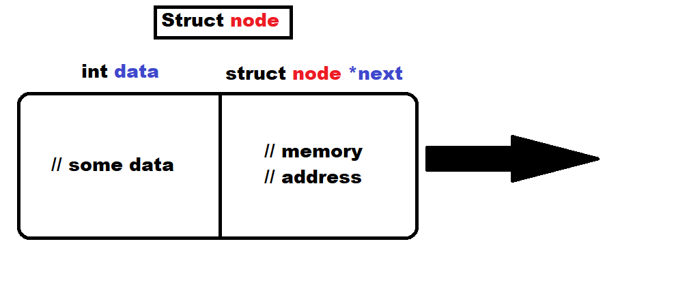
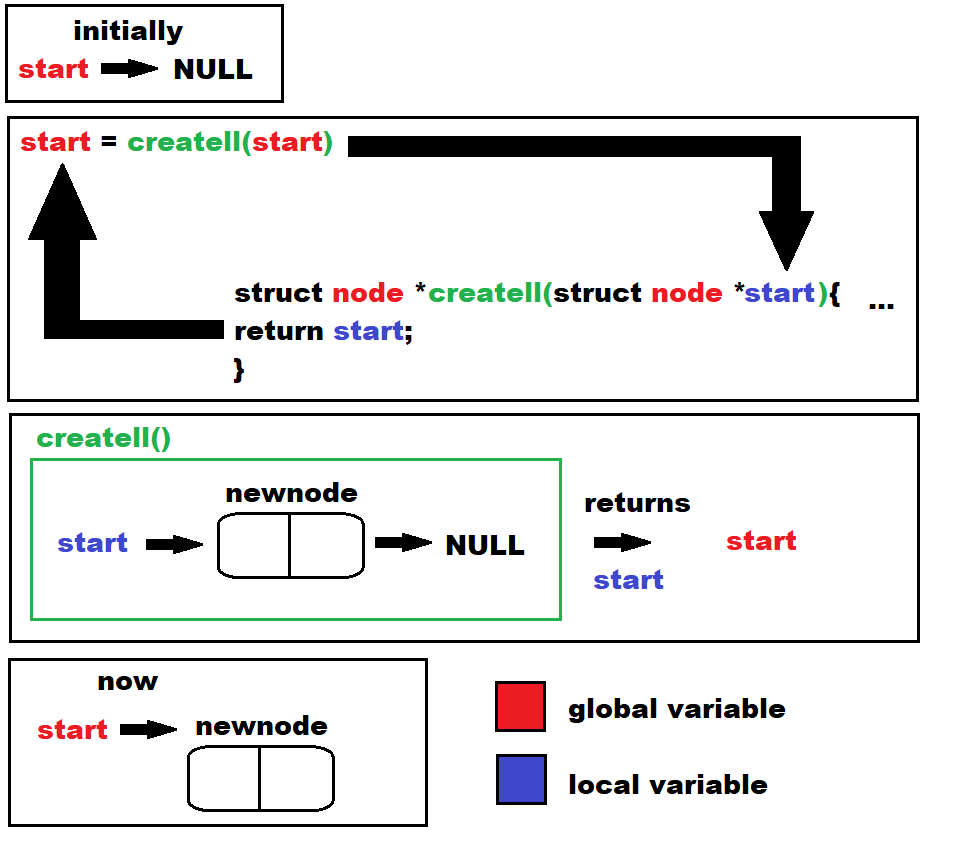

# Linked List In C

Menu driven Linked list in C with structure and pointers and allocating memory dynamically in Heap.

---
## Headers
```
#include <stdio.h>
#include <stdlib.h>
#include <malloc.h>
```
- make sure to add <malloc.h> which will be used to allocate memory from heap to make the nodes

---
## Structure and global variable
```
int count=0;

struct node{
    int data;
    struct node *next;
};

struct node *start = NULL;
```
- integer ***count*** will be used to keep track of the number of nodes in the linked list. it is initialized as ***0***
- ***struct node*** has an integer called ***data*** and a pointer named ***next*** that points to a node
- initialize a pointer called ***start*** that points to a node as having value ***NULL***

---

## main function
```
int main(void){

    start=createll(start);
    
    int k=0;
    
    while(k!=-1){
    
      //... print operations that can be performed by user
    
      scanf("%d",&k);
    
      switch(k){
      
        //... insert case
        
        default: 
          k=-1;
          break;
        
      }
      
    }
    
    return 0;
    
}
```
- invoke the ***createll()*** function passing the global pointer ***start*** as the parameter and store the return value back into ***start***
- create a local integer variable ***k*** as ***0*** 
- create a ***while*** statement that checks if the value of ***k*** is not -1
- print operations that can be performed
- take input from user and store it in ***k***
- use the ***switch*** statement and pass ***k*** as the parameter. these will be the options for the operations to be performed
- as the ***default*** case reassign ***k*** as ***-1***
- close switch and while
- ***return 0*** to terminate main function
---
## Functions
### 1. createll()
```
struct node *createll(struct node *start){

    int num;
    struct node *newnode, *ptr;
    scanf("%d",&num);
    
    while(num!=-1){
      newnode = (struct node *)malloc(sizeof(struct node));
      newnode->data=num;
      
      if(start == NULL){
        start=newnode;
        newnode->next=NULL;
      }
      else{
        ptr=start;
        while(ptr->next != NULL){
          ptr=ptr->next;
        }
        ptr->next=newnode;
        newnode->next=NULL;
      }
      
      scanf("%d",&num);
    }
    return start;
};
```
- function ***createll()*** is of type pointer that points to structure node as we are returning ***start*** which is a pointer
- pass parameter pointer ***start*** into this function
- integer ***num*** stores the number to be added to linked list
- create two pointers ***newnode*** and ***ptr*** that can point to address of structure node
- take a user input and store it in ***num***
- use a ***while*** statement and check to see if ***num*** is ***-1***
- using the ***sizeof()*** function, pass ***struct node*** to get the size of the structure node. using the ***malloc()*** function pass the earlier value to allocate memory in the heap equal to the size of the structure node. assign this memory address to ***newnode*** so that it points to the starting address of this newly created memory
- assign the ***data*** of ***newnode*** as variable ***num***
- check if ***start*** is equal to ***NULL***. if ***True*** that means there are no nodes in our linked list. if ***False*** it means there is atleast one node in the linked list
- assuming if statement returns ***True***, assign the address of the starting value of the memory of ***newnode*** to ***start*** and assign the ***next*** of ***newnode*** as ***NULL*** to indicate it is the newest added node and that there are no nodes after it for the time being
- assuming if statement returns ***False***, assign pointer ***ptr*** as ***start*** so that it points to the first node.
- using a ***while*** statement check if ***next*** of the node that the pointer ***ptr*** is currently pointing to is set to ***NULL*** i.e check if the next node is the last node
- assign pointer ***ptr*** as the ***next*** value of the node that the pointer ***ptr*** is pointing to i.e move pointer to the last node until it reaches the last node and end the while loop
- assign the ***next*** of the last node which is pointed to by the pointer ***ptr*** currently as the memory address of ***newnode*** i.e adding newnode to the end of the list.
- assign the ***next*** of the ***newnode*** as ***NULL*** so that the newly added node does not point to any other node as it is the last added node.
- take input from user and assign it to ***num*** to add the next number to the list for the next iteration. additionally, if num is -1 then the while loop will be broken out of.
- return the value of the pointer ***start*** which points to the starting address of the linked list



### 2. displayll()
```
//code here
```

---
TO DO:
- [x] Write createll()
- [ ] Write displayll()
- [ ] Write insertbegin()
- [ ] Write insertbetween()
- [ ] Write deletenode()
- [ ] Write updatecount()
- [ ] Write deletebetween()
- [ ] Write insertbefore()
- [ ] Write insertafter()
